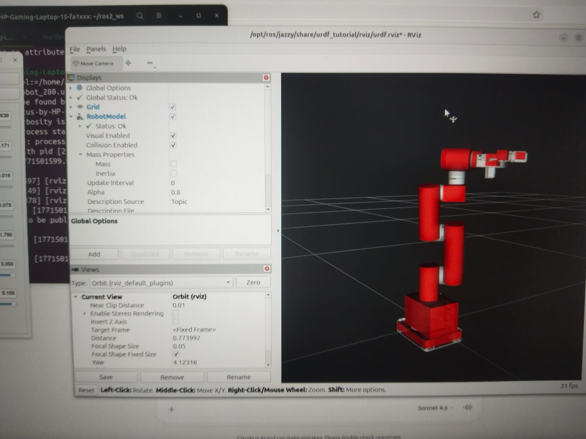
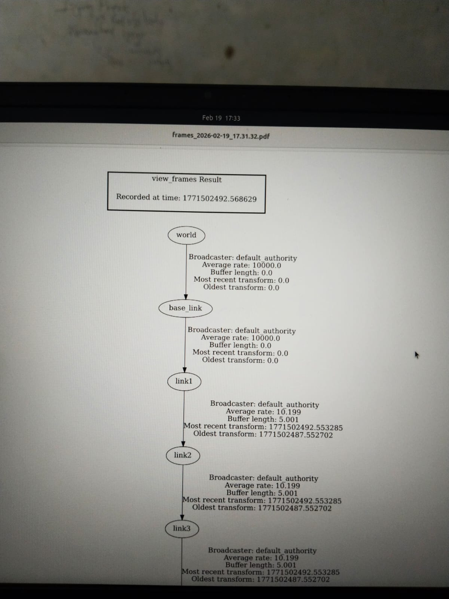

# MyCobot Visualization — ROS2 Jazzy

A ROS2 Jazzy package for 3D visualization of the **Elephant Robotics MyCobot 6-DOF collaborative robot arm** using URDF/Xacro robot description files rendered in RViz2.

  

---
## Screenshots





## 📌 Overview

This package provides the complete robot description for the **MyCobot** manipulator by Elephant Robotics — a lightweight 6 Degrees of Freedom (6-DOF) collaborative robot arm. The robot model is defined using **URDF (Unified Robot Description Format)** and modular **Xacro** macros, and is visualized in **RViz2**, the standard 3D visualization tool in the ROS2 ecosystem.

This is useful for:
- Studying robot kinematics and joint structure
- Testing configurations before deploying on real hardware
- Simulating sensor placement and end-effector design
- Learning ROS2 TF2 transform trees and robot modeling

---

## 🤖 What You Can Visualize

- Full 6-DOF robot arm with all joints and links
- Gripper / end-effector attached at the tip
- Sensor mounts (camera, lidar placeholders)
- Real-time joint state control 
- TF2 coordinate frame tree of the entire robot
- 3D mesh models of each robot link (STL/DAE)

---

## 📁 Package Structure

```
mycobot_ros2/
├── mycobot_ros2/                  # Top-level meta-package
│   ├── package.xml                # Package dependencies and metadata
│   └── README.md                  # Package-level info
│
└── mycobot_description/           # Main description package
    ├── urdf/                      # All robot description files
    │   ├── robots/                # Complete robot Xacro files (full arm assembly)
    │   ├── mech/                  # Mechanical structure — links, joints, geometry
    │   └── sensors/               # Sensor description Xacros (camera, etc.)
    ├── meshes/                    # 3D mesh files (STL/DAE) for each robot link
    ├── launch/                    # Launch files to start RViz2 with the robot
    ├── rviz/                      # Pre-configured RViz2 configuration files
    ├── CMakeLists.txt             # Colcon build configuration
    └── package.xml                # Package dependencies
```

### Key Files Explained

| File/Folder | Purpose |
|---|---|
| `urdf/robots/` | Top-level Xacro that assembles the full robot by including mech and sensor macros |
| `urdf/mech/` | Defines individual links (base, arm segments, gripper) and joint properties |
| `urdf/sensors/` | Adds sensor frames and descriptions to the robot model |
| `meshes/` | Visual and collision 3D mesh files referenced by the URDF |
| `launch/` | ROS2 launch files — run these to start visualization |
| `rviz/` | Saved RViz2 layouts so the robot loads with correct display settings |

---

## ⚙️ Prerequisites

| Requirement | Version |
|---|---|
| OS | Ubuntu 24.04 LTS |
| ROS2 | Jazzy Jalisco |
| Build Tool | Colcon |
| Visualization | RViz2 |

Make sure ROS2 Jazzy is sourced in your terminal:
```bash
source /opt/ros/jazzy/setup.bash
```

---

## 🚀 Installation

**1. Clone the repository into your ROS2 workspace:**
```bash
cd ~/ros2_ws/src
git clone https://github.com/codeubermensch/mycobot-visualization-ros2.git
```

**2. Install dependencies:**
```bash
cd ~/ros2_ws
rosdep install --from-paths src --ignore-src -r -y
```

**3. Build the package:**
```bash
colcon build --packages-select mycobot_description
```

**4. Source the workspace:**
```bash
source install/setup.bash
```

---

## 🖥️ Usage — Visualizing in RViz2

**Launch the robot visualization:**
```bash
ros2 launch mycobot_description display.launch.py
```

This will open **RViz2** with the MyCobot model loaded. A `joint_state_publisher_gui` window will also appear allowing you to **manually move each joint** using sliders and observe the robot motion in real time.

**To inspect the robot's TF tree:**
```bash
ros2 run tf2_tools view_frames
```
This generates a PDF showing the full coordinate frame hierarchy of the robot.

**To view the raw URDF output from Xacro:**
```bash
ros2 run xacro xacro urdf/robots/mycobot_280.urdf.xacro
```

---

## 🎥 Demo

▶️ [Watch visualization demo on YouTube](https://youtu.be/SxhpazKLbM8?si=LH3hmaqNjwpt1WBR)

---

## 🔧 How Xacro Files Are Organized

The URDF is split into modular Xacro files following ROS best practices:

- `mech/` Xacros define the **physical structure** — each link's geometry, inertia, and joint limits
- `sensors/` Xacros define **sensor frames** that can be optionally attached
- `robots/` Xacro is the **top-level file** that includes and assembles everything together

This modular approach makes it easy to swap end-effectors, add sensors, or modify individual links without touching the entire robot description.

---

## 📦 Dependencies

- `robot_state_publisher` — publishes TF transforms from URDF joint states
- `joint_state_publisher_gui` — GUI sliders for manual joint control
- `rviz2` — 3D visualization
- `xacro` — macro processor for modular URDF files

---

## 📄 References

- [Elephant Robotics Official GitHub](https://github.com/elephantrobotics/mycobot_ros2)
- [MyCobot Product Page](https://www.elephantrobotics.com/en/mycobot-en/)
- [ROS2 URDF Documentation](https://docs.ros.org/en/jazzy/Tutorials/Intermediate/URDF/URDF-Main.html)
- [RViz2 Documentation](https://github.com/ros2/rviz)

---

## 👤 Author

**codeubermensch**
[GitHub](https://github.com/codeubermensch)

---

*Built with ROS2 Jazzy on Ubuntu 24.04*
